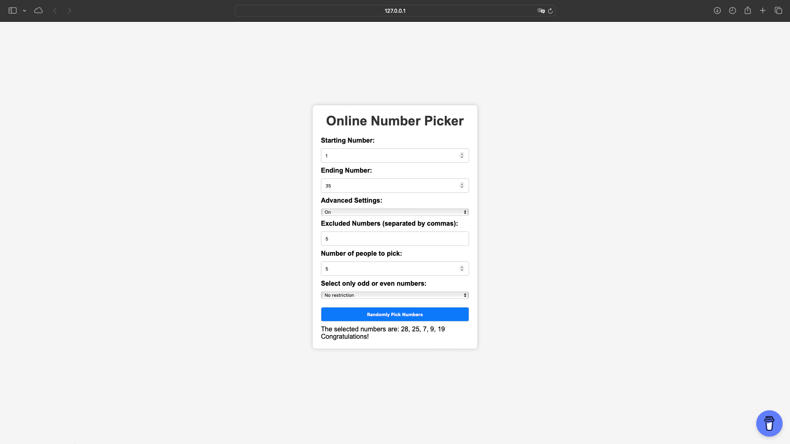
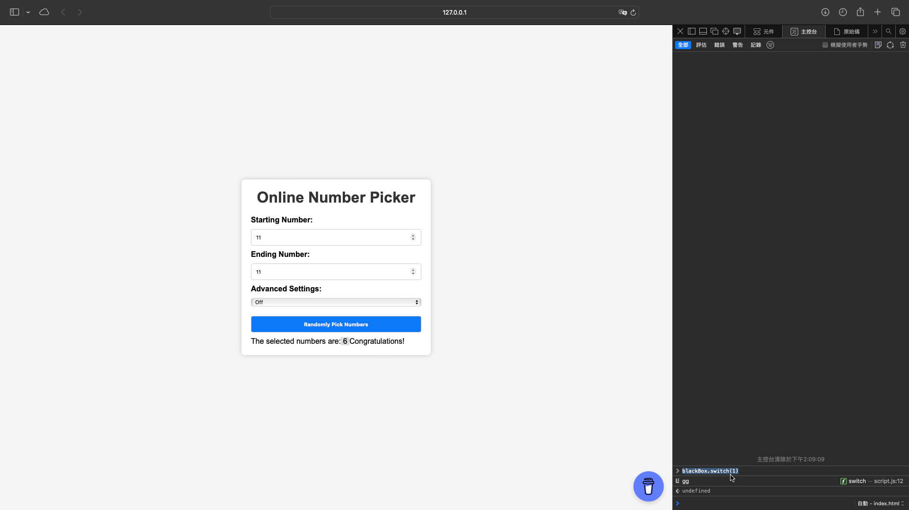

# Online Number Picker

## Description

The Online Number Picker is a web-based application that randomly selects numbers within a specified range. It includes advanced settings to customize the number selection process, such as excluding specific numbers, choosing the number of people to pick for, and limiting selections to odd or even numbers. Additionally, it features a "black box" that can modify specific numbers if enabled.

## Features

- **Custom Range Selection:** Specify the starting and ending numbers for the range.
- **Advanced Settings:** 
  - Exclude specific numbers.
  - Select the number of people to draw numbers for.
  - Choose to pick only odd or even numbers.
- **Black Box Feature:** Toggle an advanced feature that can change specific selected numbers.

## Usage

1. **Set Number Range:**
   - Enter the starting number in the "Starting Number" field.
   - Enter the ending number in the "Ending Number" field.

2. **Toggle Advanced Settings:**
   - Use the "Advanced Settings" dropdown to enable or disable advanced settings.
   - If enabled, specify the numbers to exclude, the number of people to pick for, and whether to select only odd or even numbers.

3. **Generate Numbers:**
   - Click the "Randomly Pick Numbers" button to generate random numbers based on the specified settings.
   - The selected numbers will be displayed below the form.

4. **Black Box Feature:**
   - Open the browser console and use `blackBox.switch(1)` to enable the black box or `blackBox.switch(0)` to disable it.
   - The black box modifies the number 11 to 6 if enabled. This can be customized in the `script.js` file.

## Screenshots

## License

This project is licensed under the MIT License. See the LICENSE file for details.

## Support

If you find this project helpful, please consider supporting me on [Buy Me a Coffee](https://www.buymeacoffee.com/york0524).